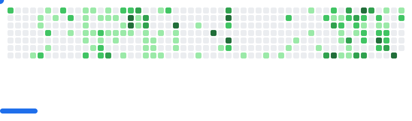

<b>

 
	

	

 <!--  -->
### 👨‍💻 About me

- Looking for freelance opportunities
- Comfortable in Nextjs , Express, Node Js , MongoDB.
- I’m currently learning Nextjs
- How to reach me: stu@utsavbhattarai.info.np  

	
### 🛠 Languages and Tools:

<h3>📕 Latest Blog Posts</h3>

<!-- BLOG-POST-LIST:START -->
- [From Kathmandu to Bengaluru: My Experience at GNOME Asia Summit 2024](https://utsavbhattarai.hashnode.dev/gnome-asia-summit-2024)
- [Introducing gc - AI Powered git commit message generator](https://utsavbhattarai.hashnode.dev/gc)
- [Say Hello to AI-KYC: The Next-Gen KYC Verification](https://utsavbhattarai.hashnode.dev/say-hello-to-ai-kyc-the-next-gen-kyc-verification)
- [Introducing Apexa - The Analyzer](https://utsavbhattarai.hashnode.dev/introducing-apexa-the-analyzer)
- [A Recap of Hacktoberfest 2023](https://utsavbhattarai.hashnode.dev/a-recap-of-hacktoberfest-2023)
<!-- BLOG-POST-LIST:END -->

<picture>
  <source
    media="(prefers-color-scheme: dark)"
    srcset="images/breakout-dark.svg"
  />
  <source
    media="(prefers-color-scheme: light)"
    srcset="images/breakout-light.svg"
  />
  
</picture>
